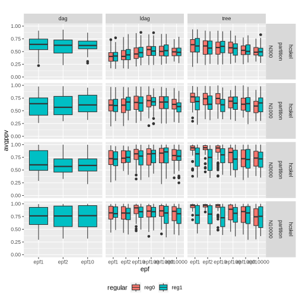
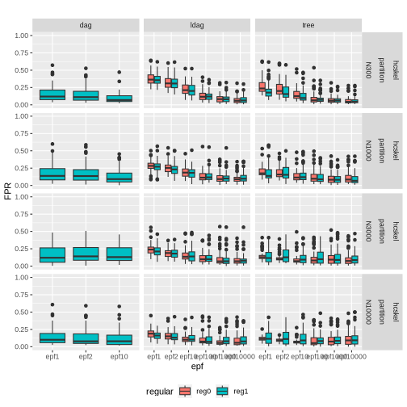
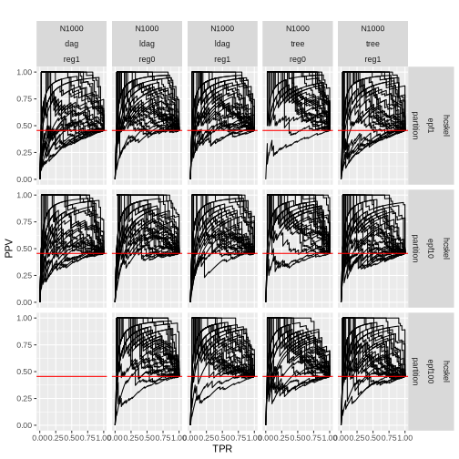
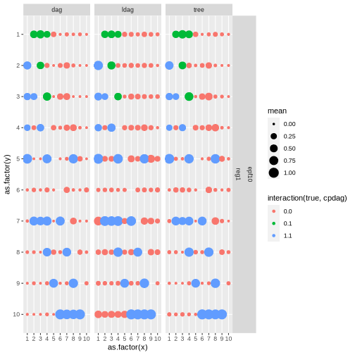
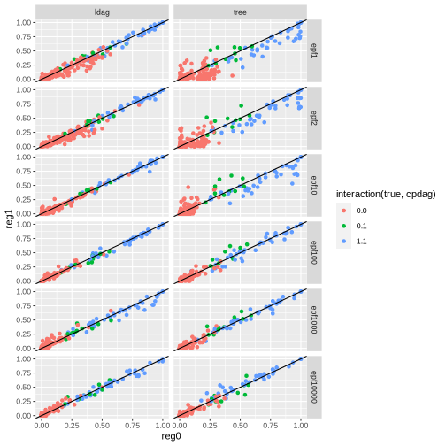
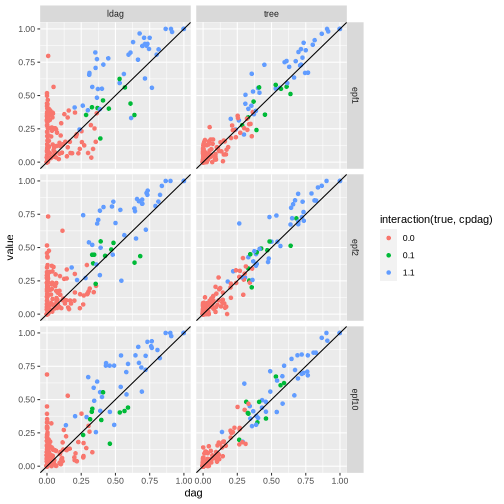

Precision-recall of ancestor relation probabilities from simulations run on a 10 node labeled DAG, comparing different optimization routines for the local independence structures and the effect of the edge-penalization factor in the graph prior. 

***

#### Variables:

- `init` algorithm for initiating the search space of the MCMC chain..
- `struct` algorithm for optimizing the local structure of CPTs. 
- `sample` algorithm for sampling structures (`order` or `partition`)
- `epf` edge penalty, a penalty term `-length(parentnodes)*log(epf)` is added to the local marginal likelihoods.
- `regular` if `TRUE` the optimized local structures are forced to be regular. 
- `ess = 1`, equivalent sample size of Bdeu-prior.
- `hardlimit = 5`, maximum parent size.


#### Notes: 
- For each simulation run `r` and samplesize `N` (unintended), a random distribution over the structure is drawn and a data set sampled from the network. The same data set is used across all other params. 

# PREP


```r
library(doSNOW)
library(foreach)
library(dplyr)
library(ggplot2)

simname <- "LDAG10_3"
here::i_am(paste0("./simulations/", simname, "/results.Rmd"))
```

```
## here() starts at /mn/sarpanitu/ansatte-u6/verahk/Documents/git/ldags
```

```r
bnname <- "LDAG10"
filepaths <- list.files(here::here("simulations", simname, "MCMCchains"), full.names = T)
names <- c("network", "init", "struct", "sample", "epf",  "regular", "N", "r")
```


```r
eval_files <- function(filepaths, bnname, prmethod, verbose = F) {
  
  indx <- grepl(bnname, filepaths, T)
  if (!all(indx)) stop("All files do not match bnname.")
  
  bn <- readRDS(here::here("./data/", paste0(bnname, ".rds")))
  n  <-  length(bn)
  dag  <- bnlearn::amat(bn)
  dmat <- bida:::descendants(bn)
  
  foreach(f = filepaths, 
                 .combine  = "rbind",
                 .packages = "Matrix") %dopar% eval_MCMCchain(f, dag, dmat, n, prmethod, seq_len(200), verbose = verbose)
  
  
}


eval_MCMCchain <- function(f, dag, dmat, n, prmethod, burninsamples, verbose = T) {
  if (verbose) cat(f)
  MCMCchain  <- readRDS(f)
  if ("smpl" %in% names(MCMCchain))  MCMCchain <- MCMCchain$smpl
 
  dindx <- diag(n) == 1
  dags <- lapply(MCMCchain$traceadd$incidence[-burninsamples], as.matrix)
  
  # list unique DAGs
  u    <- unique(dags)
  support  <- bida:::rowsum_fast(rep(1/length(dags), length(dags)), dags, u)
  dags <- u 
  dmats <- lapply(dags, bida:::descendants)
  
  # compute posterior edge probs
  edgep <- Reduce("+", Map("*", dags, support))[!dindx]
  ancp  <- Reduce("+", Map("*", dmats, support))[!dindx]
  
  res <- matrix(nrow = 2, ncol = 3)
  colnames(res) <- c("TPR", "FPR", "avgppv")
  rownames(res) <- c("edgep", "ancp")
  
  # edge probs
  n1 <- sum(dag)

  res[1, 1] <- sum(edgep[dag[!dindx] == 1])/n1
  res[1, 2] <- sum(edgep[dag[!dindx] == 0])/(n**2-n-n1)
  res[1, 3] <- ldags:::compute_avgppv(edgep, dag[!dindx], method = prmethod)
  
  # arp
  pr <- ldags:::compute_prec_recall(ancp, dmat[!dindx], method = prmethod)
  
  n1 <- sum(dmat)-n
  res[2, 1] <- sum(ancp[dmat[!dindx] == 1])/n1
  res[2, 2] <- sum(ancp[dmat[!dindx] == 0])/(n**2-n-n1)
  #res[2, 3] <- compute_avgppv(ancp, dmat)
  res[2, 3] <- pr$avgppv 
  
  # parent set size 
  ps <- bida:::parent_support_from_dags(dags, support)
  wmean <- mapply(function(m, w) ncol(m)-rowSums(is.na(m))%*%w,
                  m = ps$sets, 
                  w = ps$support)
  #stopifnot(abs(wmean[5] - sum(sapply(dags, function(g) sum(g[, 5]))*support)) < 10**-10)
  
  list(edgep = edgep, 
       rates = res, 
       pr = pr$df,
       npar = wmean,
       toc = as.matrix(attr(MCMCchain, "toc")))
  
}


res_to_df <- function(res, filepaths, names = c("network", "init", "struct", "sample", "epf", "regular", "N", 
"r")) {
  
  tmp <- stringr::str_split(filepaths, ".+MCMCchains/|_|.rds", simplify = F)
  par <- data.frame(do.call(rbind, tmp)[, seq_along(names)+1])
  colnames(par) <- names
  char_to_factor <- function(x, sub) {
    u <- unique(x)
    ordr <- order(as.numeric(gsub(sub, "", u)))
    factor(x, u[ordr])
  }
  par$N <- char_to_factor(par$N, "N")
  par$epf <- char_to_factor(par$epf, "epf")

  tmp <- do.call(rbind, res)
  if (nrow(tmp) == length(filepaths)) {
    return(cbind(par, tmp))
  } else {
    nrows <- vapply(res, nrow, integer(1))
    df <- cbind(par[rep.int(seq_along(filepaths), nrows), ], tmp)
    df$name <- rownames(tmp)
    return(df)
  }
}
```


```r
plot_box_plot <- function(df, x, y, title = "", fill = "struct", facets = "algo+name~network+epf") {
  plot <- ggplot(df, aes(x = !! sym(x), y = !! sym(y), fill = !! sym(fill))) +
    facet_grid(as.formula(facets), scales = "free") +
    geom_boxplot() +
    ggtitle(title) +
    theme(legend.position = "bottom")
  
  if (fill == "struct") plot <- plot + scale_fill_manual(values = c(dag = "green", ldag = "red", tree = "blue"))
  return(plot)
}
plot_prec_recall <- function(df, title = "", facets = "algo+struct+epf~network+N") {
  rate <- df$PPV[nrow(df)]
  ggplot(df, aes(TPR, PPV, group = r)) +
    facet_grid(as.formula(facets)) +
    geom_line() +
    geom_hline(yintercept = rate, color = "red") +
    ggtitle(title)
}
plot_prec_recall_step <- function(df, title = "", facets = "algo+struct+epf~network+N") {
  rate <- df$PPV[nrow(df)]
  ggplot(df, aes(TPR, PPV, group = r)) +
    facet_grid(as.formula(facets)) +
    geom_hline(yintercept = rate, color = "red") +
    geom_step(direction = "vh") +
    geom_point(data = dplyr::filter(df, !is.infinite(df$x)),
               color = "blue", size = .5) +
    ggtitle(title)
}
```


Compute precision recall of each sample of DAGs

```r
cl <- makeCluster(5, "SOCK", outfile = "")
export <- as.vector(lsf.str(envir = .GlobalEnv))
clusterExport(cl, export)
registerDoSNOW(cl)
  

res <- eval_files(filepaths, bnname, prmethod = "noise", verbose = T)
```

Count number of runs for each setting>

```r
df <- res_to_df(as.list(seq_along(filepaths)), filepaths, names)
head(df)
tidyr::pivot_wider(aggregate(rep(1, nrow(df)), df[, names[!names == "r"]], sum), 
                   names_from = "struct", values_from = "x")
```

```
##   network   init struct    sample  epf regular     N   r tmp
## 1  LDAG10 hcskel    dag partition epf1    reg1 N1000 r01   1
## 2  LDAG10 hcskel    dag partition epf1    reg1 N1000 r02   2
## 3  LDAG10 hcskel    dag partition epf1    reg1 N1000 r03   3
## 4  LDAG10 hcskel    dag partition epf1    reg1 N1000 r04   4
## 5  LDAG10 hcskel    dag partition epf1    reg1 N1000 r05   5
## 6  LDAG10 hcskel    dag partition epf1    reg1 N1000 r06   6
## # A tibble: 48 × 9
##    network init   sample    epf      regular N      ldag  tree   dag
##    <chr>   <chr>  <chr>     <fct>    <chr>   <fct> <dbl> <dbl> <dbl>
##  1 LDAG10  hcskel partition epf1     reg0    N300     30    30    NA
##  2 LDAG10  hcskel partition epf2     reg0    N300     30    30    NA
##  3 LDAG10  hcskel partition epf10    reg0    N300     30    30    NA
##  4 LDAG10  hcskel partition epf100   reg0    N300     30    30    NA
##  5 LDAG10  hcskel partition epf1000  reg0    N300     30    30    NA
##  6 LDAG10  hcskel partition epf10000 reg0    N300     30    30    NA
##  7 LDAG10  hcskel partition epf1     reg1    N300     30    30    30
##  8 LDAG10  hcskel partition epf2     reg1    N300     30    30    30
##  9 LDAG10  hcskel partition epf10    reg1    N300     30    30    30
## 10 LDAG10  hcskel partition epf100   reg1    N300     30    30    NA
## # … with 38 more rows
```


# Parent set size 
Compare the average number of parents of a node in the sampled DAGs. 
The box plots shows the distribution of over nodes and simulation runs. 

```r
# Parent set size -----
df <- res_to_df(res[, "npar"], filepaths, names)
df <- tidyr:::pivot_longer(df, names(df)[!names(df) %in% names], values_to = "avg_npar")
facets <- "init+sample+N~struct"
plot_box_plot(df, x = "epf", y = "avg_npar", fill = "regular", facets = facets) 
```


# AVERAGE PRECISION, TRUE AND FALSE POSITIVES 
Across edge penalty `epf` and regularity `reg`:

```r
df <- res_to_df(res[, "rates"], filepaths, names)

facets <- "init+sample+N~struct"
plot_box_plot(df, x = "epf", y = "avgppv", fill = "regular", facets = facets) + ylim(0, 1)
```



```r
plot_box_plot(df, x = "epf", y = "TPR", fill = "regular", facets = facets) + ylim(0, 1)
```


```r
plot_box_plot(df, x = "epf", y = "FPR", fill = "regular", facets = facets) + ylim(0, 1)
```




# PRECISION RECALL CURVES 

```r
indx <- grepl("_epf1_|_epf10_|_epf100_", filepaths) & grepl("_N1000_", filepaths)
df <- res_to_df(res[indx, "pr"], filepaths[indx], names)

for (x in unique(df$init)) {

    facets <- "init+epf+sample~N+struct+regular"
    indx <- df$init == x 
    plot <- plot_prec_recall(df[indx, ], facets = facets)
    print(plot)
  
}
```



# EDGE PROBABILITIES 
Check if there are particular edges that the local-structure-routines handle differently,
by comparing the posterior means of each edge. The posterior means are averaged over all 
simulation runs for every simulation setting. 


```r
indx <- grepl("N1000", filepaths)
df <- res_to_df(res[indx, "edgep"], filepaths[indx], names)
df <- tidyr:::pivot_longer(df, -all_of(names))

bn <- readRDS(here::here("./data/LDAG10.rds"))
n <- 10
df$y <- (as.numeric(df$name)-1)%/%(n-1) +1
df$x <- rep(.row(c(n, n))[!diag(n) == 1], sum(indx))

df_agg <- group_by(df, across(c(names[-length(names)], "x", "y"))) %>% 
  summarize(mean = mean(value))
```

```
## `summarise()` has grouped output by 'network', 'init', 'struct', 'sample', 'epf', 'regular', 'N', 'x'. You can override
## using the `.groups` argument.
```

```r
df_agg$cpdag <- bnlearn::amat(bnlearn::cpdag(bn))[cbind(df_agg$x, df_agg$y)]
df_agg$true <- bnlearn::amat(bn)[cbind(df_agg$x, df_agg$y)]


df_agg %>% 
  filter(epf == "epf10", regular == "reg1") %>% 
ggplot(aes(as.factor(x), as.factor(y), 
                   size = mean, 
                   color = interaction(true, cpdag))) +
  facet_grid(epf+regular~struct) +
  geom_point() +
  scale_y_discrete(limits=rev) 
```



```r
df_agg %>% 
  filter(struct != "dag") %>% 
  tidyr::pivot_wider(names_from = "regular", values_from = "mean") %>% 
  ggplot(aes(reg0, reg1, color = interaction(true, cpdag))) + 
    facet_grid(epf~struct) +
    geom_point() +
    geom_abline(slope = 1, intercept = 0)
```



```r
df_agg %>% 
  filter(regular == "reg1") %>% 
  tidyr::pivot_wider(names_from = "struct", values_from = "mean") %>% 
  filter(!is.na(dag)) %>% 
  tidyr::pivot_longer(c("ldag", "tree"), names_to = "struct") %>% 
  ggplot(aes(dag, value, color = interaction(true, cpdag))) + 
    facet_grid(epf~struct) +
    geom_point() +
    geom_abline(slope = 1, intercept = 0)
```



# RUN TIMES 

```r
df <- res_to_df(res[, "toc"], filepaths, names)
facets <- "name~init+regular+epf+sample"

for (x in unique(df$init)) {
  indx <- df$init == x 
  plot <- plot_box_plot(df[indx, ],  x = "N", y = "tmp", fill = "struct", facets = facets)
  print(plot)
}
```


