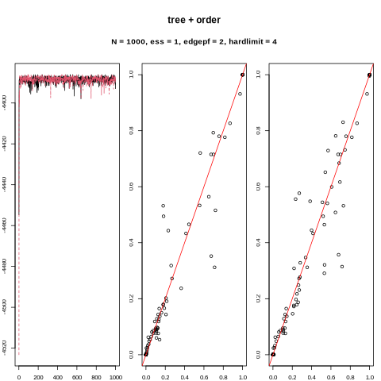
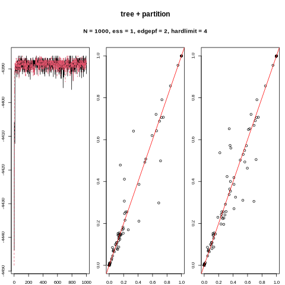
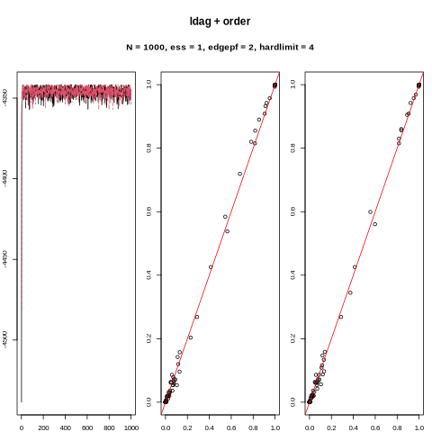
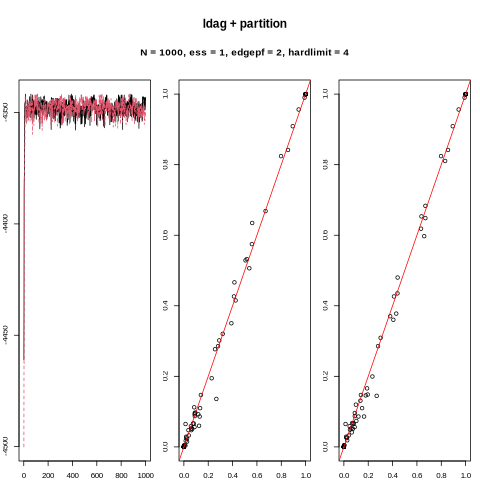
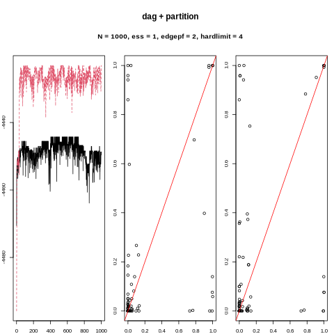

# Convergence diagnostics
The plots shows traceplots and posterior edge probabilities from two subsequent MCMC runs on the same data set, sampled from the LDAG10 network. 

{ width=50% }
{ width=50% }

{ width=50% }
{ width=50% }

{ width=50% }
{ width=50% }

