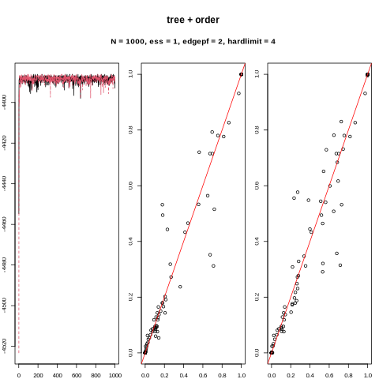
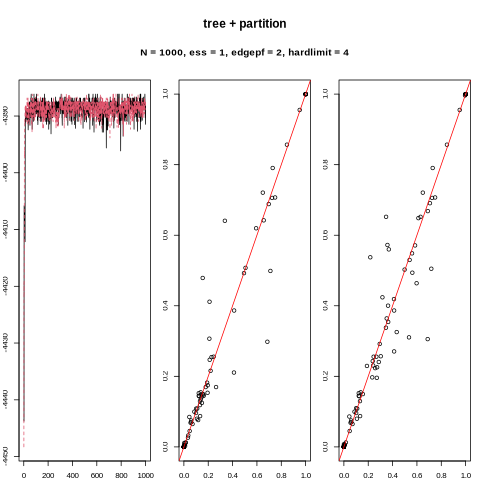
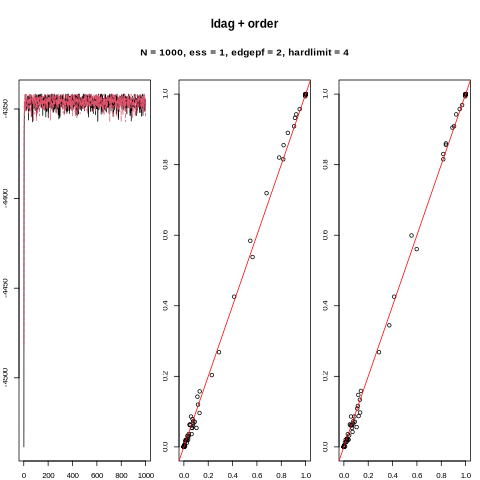
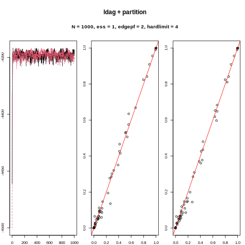
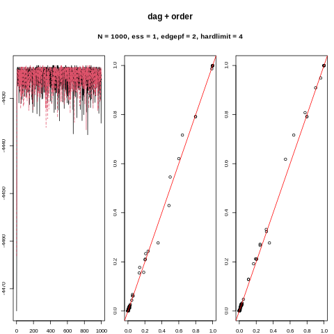
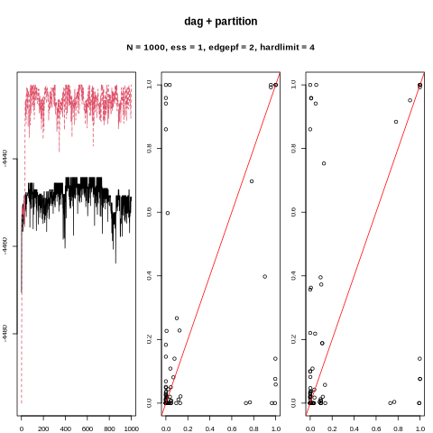

```{r setup, include=FALSE}
knitr::opts_chunk$set(
	echo = TRUE,
	warning = FALSE,
	cache = TRUE,
	fig.show = "hold",
	results = "hold"
)
```


# Prep
```{r message=FALSE}
library(doSNOW)
library(BiDAG)
library(ldags)
library(ggplot2)
library(dplyr)
here::i_am("./simulations/bn/simulation_bn.Rmd")
simpar <- expand.grid(list(method = c("ldag", "tree", "dag"),
                           N = c(100, 1000, 10000),
                           r = 1:30))
cl <- makeCluster(4)
doRun <- F
```


# Convergence diagnostics
The plots shows traceplots and posterior edge probabilities from two subsequent MCMC runs on the same data set, sampled from the LDAG10 network. 

{ width=50% }
{ width=50% }

{ width=50% }
{ width=50% }

{ width=50% }
{ width=50% }


# Evaluate 

## Define routines for evaluating the sampled DAGs.
```{r}
library(ggplot2)
library(dplyr)

filepaths <- list.files(here::here("./simulations/bn/MCMCchains"), pattern = "epf.+.rds", full.names = T)
tmp <- stringr::str_split(filepaths, ".+MCMCchains/|_|.rds", simplify = F)

par <- data.frame(do.call(rbind, tmp)[, 2:7])
colnames(par) <- c("network", "algo", "struct", "N", "epf", "r")
par$N <- factor(par$N, c("N100", "N300", "N1000", "N3000", "N10000"))
stopifnot(length(unique(par$epf)) ==  2)
```

```{r }
compute_posterior_probs <- function(smpl, burninsamples) {

  # list unique DAGs
  dags <- lapply(smpl$traceadd$incidence[-burninsamples], as.matrix)
  u    <- unique(dags)
  support  <- bida:::rowsum_fast(rep(1/length(dags), length(dags)), dags, u)
  dags <- u 
  dmats <- lapply(dags, bida:::descendants)
  
  list(edgep = Reduce("+", Map("*", dags, support)),
       ancp  = Reduce("+", Map("*", dmats, support)))
}


compute_prec_recall <- function(x, y) {
  indx <- order(x, decreasing = TRUE)
  tp  <- cumsum(y[indx])
  cbind(x = x[indx], TPR = tp/sum(y), PPV = tp/seq_along(y))
}

avgppv <- function(x, y) {
  np  <- (length(x)-rank(x+runif(length(x))/1000) +1)  # number of instances with equal to or lower values of x
  pp  <- np[y == 1] # number of positive predictions at each true positive     
  # cbind(np, x, y)[order(x), ]
  ppv <- seq_along(pp)/sort(pp)                       # precision at each positive
  mean(ppv)
}
```


```{r, cache = T}
eval <- function(network, epf) {


  indx  <- which(par$network == network & par$epf == epf)
  if (length(indx) == 0) return(NULL)
  burninsamples <- seq_len(200)
  probs <- lapply(filepaths[indx], 
                  function(f) compute_posterior_probs(readRDS(f)$smpl, seq_len(200)))
  
  bn <- readRDS(here::here("./data/", paste0(network, ".rds")))
  dag  <- bnlearn::amat(bn)
  dmat <- bida:::descendants(bn)
  n <- length(bn)
  dindx <- diag(n) == 1
  
 
  
  # Edge probabilities 
  edgeps <- lapply(probs, "[[", "edgep")
  n1  <- sum(dag)
  tmp <- lapply(edgeps, 
                function(x) c(TPR = sum(x[dag==1])/n1, FPR = sum(x[dag == 0])/(n**2-n1)))
  df <- data.frame(par[indx, ], do.call(rbind, tmp))
  df_long <- tidyr:::pivot_longer(df, cols = c("TPR", "FPR"))
  
  ggplot(df_long, aes(N, y = value, fill = struct)) +
    facet_grid(algo+epf~network+name) +
    geom_boxplot() +
    ggtitle("Average true and false positive edge rate") -> plot
  print(plot)
  
  # ARP 
  ancps <- lapply(probs, "[[", "ancp")
  tmp   <- lapply(ancps, 
                  function(x) compute_prec_recall(x[!dindx], dmat[!dindx]))
  
  df <- data.frame(par[rep(indx, each = n*(n-1)), ], 
                   do.call(rbind, tmp))
  
  ggplot(df, aes(TPR, PPV, group = r)) +
  facet_grid(algo+struct+epf~network+N) +
  geom_hline(yintercept = mean(dmat[!dindx]), color = "red") +
  geom_line() +
  ggtitle("Ancestor relation probabilities") -> plot
  print(plot)
  

  
  # Average precision
  df <- par[indx, ]
  df$ancp <- vapply(ancps, function(x) avgppv(x[!dindx], dmat[!dindx]), numeric(1))
  df$edgep <- vapply(edgeps, function(x) avgppv(x[!dindx], dag[!dindx]), numeric(1))
  df_long <- tidyr:::pivot_longer(df, cols = c("edgep", "ancp"))
  
  ggplot(df_long, aes(N, y = value, fill = struct)) +
    facet_grid(algo+epf~network) +
    geom_boxplot() +
    ggtitle("Average precision") -> plot
  print(plot)
  
  # run times 
  tocs <- lapply(filepaths[indx], 
                 function(f) attr(readRDS(f)$smpl, "toc"))
  names <- unique(lapply(tocs, names))
  tmp <- do.call(rbind, tocs)
  colnames(tmp) <- names[[1]]
  df <- data.frame(par[indx, ], tmp)
  
  df_long <- tidyr:::pivot_longer(df, names[[1]])
  ggplot(df_long, aes(N, y = value, fill = name)) +
      facet_grid(algo+struct+epf~network, scales = "free") +
      geom_boxplot() +
      ggtitle("Runtimes") -> plot
  print(plot)
}


```


## Labeled DAG with 10 nodes
### Edge penalization factor: 2 (default value in `BiDAG`)
```{r}
eval("LDAG10", "epf2")
```

### Edge penalization factor: 4
```{r}
eval("LDAG10", "epf4")
```

## Sachs (10 variables, all with 3 categories (LOW, AVG, HIGH))
```{r}
eval("sachs", "epf2")
```

## Child (20 variables, 2-6 categories, 3 in average)
```{r}
eval("child", "epf2")
```