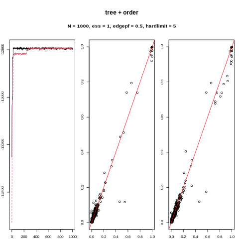
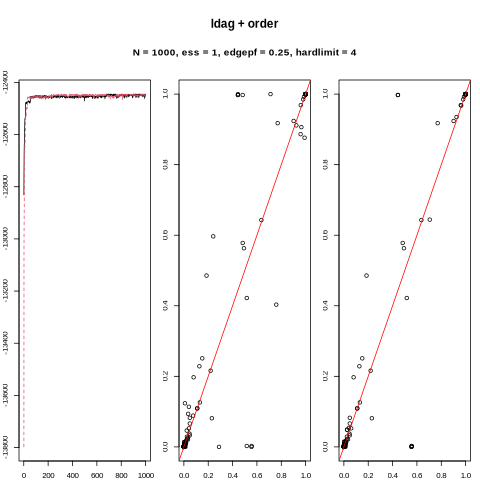
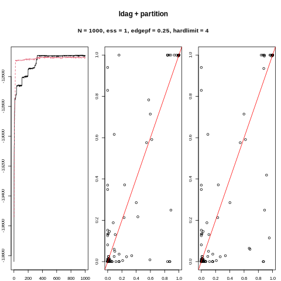
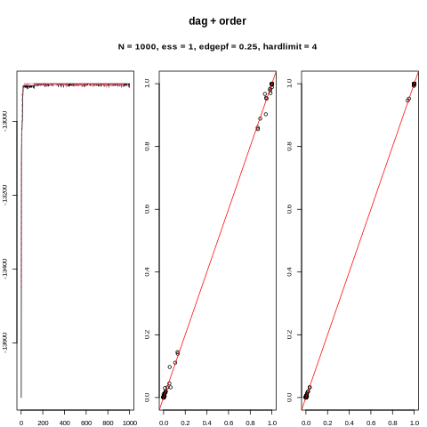
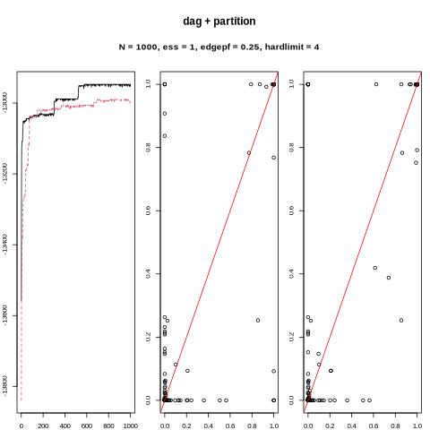

```{r setup, include=FALSE}
knitr::opts_chunk$set(
	echo = TRUE,
	warning = FALSE,
	fig.show = "hold",
	results = "hold"
)
```


# Prep
```{r}
library(doSNOW)
library(BiDAG)
library(ldags)
here::i_am("./simulations/bn/simulation_bn.Rmd")
simpar <- expand.grid(list(method = c("ldag", "tree", "dag"),
                           N = c(100, 1000, 10000),
                           r = 1:30))
cl <- makeCluster(4)
doRun <- F
```

Draw a random network based on labeled DAG with 10 nodes.
```{r}
bn <- readRDS(here::here("./data/alarm.rds"))
n  <- length(bn)
dindx <- diag(n) == 1
Rgraphviz::plot(bnlearn::as.graphNEL(bn))
```


# Convergence 
{ width=50% }
{ width=50% }

{ width=50% }
{ width=50% }

{ width=50% }
{ width=50% }


```{r}


```
# Evaluate 

```{r eval=FALSE, include=FALSE}
library(ggplot2)
library(dplyr)

filepaths <- list.files(here::here("./simulations/LDAG10/MCMCchains"), pattern = ".rds", full.names = T)
indx <- apply(sapply(sprintf("partitionMCMC.+_N%s_r%02.0f.rds", simpar$N, simpar$r), grepl, x = filepaths), 1, any)

par <- data.frame(stringr::str_split(filepaths[indx], ".+MCMCchains/|_|.rds", simplify = T)[, 2:5])
colnames(par) <- c("alg", "locals", "N", "r")
par$N <- factor(par$N, c("N100", "N300", "N1000", "N3000"))
```

```{r eval=FALSE, include=FALSE}
compute_posterior_probs <- function(smpl, burninsamples) {

  # list unique DAGs
  dags <- lapply(smpl$traceadd$incidence[-burninsamples], as.matrix)
  u    <- unique(dags)
  support  <- bida:::rowsum_fast(rep(1/length(dags), length(dags)), dags, u)
  dags <- u 
  dmats <- lapply(dags, bida:::descendants)
  
  list(edgep = Reduce("+", Map("*", dags, support)),
       ancp  = Reduce("+", Map("*", dmats, support)))
}

probs <- lapply(filepaths[indx], function(f) compute_posterior_probs(readRDS(f), seq_len(200)))
edgeps <- lapply(probs, "[[", "edgep")
avgs <- lapply(split(edgeps, par[, c("locals", "N")], drop = T),
                   function(x) Reduce("+", x)/length(x))

plot_edgep <- function(mats, dag, cpdag) {
  df <- cbind(expand.grid(dimnames(mats[[1]])), 
              dag.cpdag = interaction(dag, cpdag), 
              sapply(mats, c))
  df_long <- tidyr:::pivot_longer(df, names(mats))
  plot <- ggplot(df_long, aes(Var2, Var1, size = value, color = dag.cpdag)) +
    facet_grid(.~name) +
    geom_point() +
    scale_y_discrete(limits=rev) 
  return(plot)
}

plot_edgep(avgs[grepl("N1000", names(avgs))], bnlearn::amat(bn), as(pcalg::dag2cpdag(bnlearn::as.graphNEL(bn)), "matrix"))

```

```{r}
# evaluate ----
eval_smpl <- function(smpl, burninsamples, dag, dmat) {
  dindx <- diag(ncol(dag)) == 1 
  
  # list unique DAGs
  dags <- lapply(smpl$traceadd$incidence[-burninsamples], as.matrix)
  u    <- unique(dags)
  support  <- bida:::rowsum_fast(rep(1/length(dags), length(dags)), dags, u)
  dags <- u 
  dmats <- lapply(dags, bida:::descendants)
  
  edgep <- Reduce("+", Map("*", dags, support))[!dindx]
  ancp  <-  Reduce("+", Map("*", dmats, support))[!dindx]
  
  # compute edge prob and ARP
  list(edgep = compute_prec_recall(edgep, dag[!dindx]),
       ancp =  compute_prec_recall(ancp, dmat[!dindx]),
       avgppv = c(edgep = avgppv(edgep, which(dag[!dindx]==1)),
                  ancp = avgppv(ancp, which(dmat[!dindx]==1))))
}

compute_prec_recall <- function(x, y) {
  indx <- order(x + runif(length(x))/1000, decreasing = TRUE)
  tp  <- cumsum(y[indx])
  cbind(x = x[indx], TPR = tp/sum(y), PPV = tp/seq_along(y))
}

# avg ppv 
avgppv <- function(x, which_true) {
  np  <- (length(x)-rank(x+runif(length(x))/1000) +1)  # number of instances with equal to or lower values of x
  pp  <- np[which_true]                               # number of positive predictions at each true positive    
  ppv <- seq_along(pp)/sort(pp)                       # precision at each positive
  mean(ppv)
}
```

```{r eval=FALSE, include=FALSE}


res <- lapply(filepaths[indx], 
              function(f) eval_smpl(readRDS(f), seq_len(200), bnlearn::amat(bn), bida:::descendants(bn)))
# res <- list()
# for (f in filepaths[indx]) {
#   res[[f]] <- eval_smpl(readRDS(f), seq_len(200), bnlearn::amat(bn), bida:::descendants(bn))
# }

                                                                           
## ancestor relation
df <- data.frame(par[rep(seq_along(res), each = n*(n-1)), ], 
                 do.call(rbind, lapply(res, "[[", "ancp")))

ggplot(df, aes(TPR, PPV, group = interaction(N, r))) +
  facet_grid(N~locals) +
  geom_hline(yintercept = mean(bida:::descendants(bn)[!dindx]), color = "red") +
  geom_line() +
  ggtitle("Ancestor relation probabilities")


## edge probs
df <- data.frame(par[rep(seq_along(res), each = n*(n-1)), ], 
                 do.call(rbind, lapply(res, "[[", "edgep")))

ggplot(df, aes(TPR, PPV, group = interaction(N, r))) +
  facet_grid(N~locals) +
  geom_hline(yintercept = mean(bnlearn::amat(bn)[!dindx]), color = "red") +
  geom_line() + 
  ggtitle("Edge probabilities")


## avgppv 
df <- data.frame(par, 
                 do.call(rbind, lapply(res, "[[", "avgppv")))
df_long <- tidyr:::pivot_longer(df, cols = c("edgep", "ancp"))
ggplot(df_long, aes(N, value, fill = name)) +
  facet_grid(.~locals) +
  geom_boxplot() +
  ggtitle("Average precision")
```


